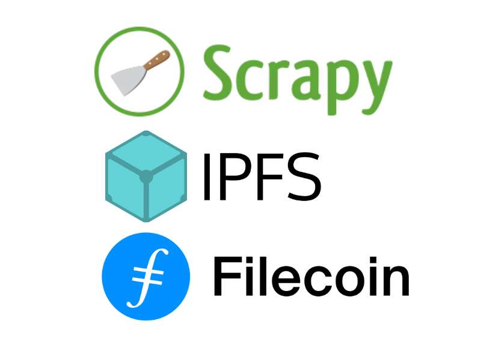

<p align="center"></p>

<h1 align="center">Welcome to Scrapy-IPFS-Filecoin</h1>
<p>
  
</p>

Scrapy is a popular open-source and collaborative python framework for extracting the data you need from websites. scrapy-ipfs-filecoin provides scrapy pipelines and feed exports to store items into IPFS and Filecoin using services like [Web3.Storage](https://web3.storage/), [LightHouse.Storage](https://lighthouse.storage/), [Estuary](https://estuary.tech/), [Pinata](https://www.pinata.cloud/) and [Moralis](https://moralis.io/).

### 🏠 [Homepage](https://github.com/pawanpaudel93/scrapy-ipfs-filecoin)

## Install
`npm install -g https://github.com/pawanpaudel93/ipfs-only-hash.git`

`pip install scrapy-ipfs-filecoin`

## Example

## Usage
1. Install ipfs-only-hash and scrapy-ipfs-filecoin.

	`npm install -g https://github.com/pawanpaudel93/ipfs-only-hash.git`

	`pip install scrapy-ipfs-filecoin`

2. Add 'scrapy-ipfs-filecoin.pipelines.ImagesPipeline' and/or 'scrapy-ipfs-filecoin.pipelines.FilesPipeline' to ITEM_PIPELINES setting in your Scrapy project if you need to store images or other files to IPFS and Filecoin.

	```python
	ITEM_PIPELINES = {
		'scrapy_ipfs_filecoin.pipelines.ImagesPipeline': 1,
		'scrapy-ipfs-filecoin.pipelines.FilesPipeline': 2
	}
	```
	
	Add store path of files or images for Web3Storage, LightHouse or Estuary as required.
	```python
	IMAGES_STORE = 'w3s://images' # For Web3Storage
	IMAGES_STORE = 'es://images' # For Estuary
	IMAGES_STORE = 'lh://images' # For LightHouse
	IMAGES_STORE = 'pn://images' # For Pinata
	IMAGES_STORE = 'ms://images' # For Moralis

	FILES_STORE = 'w3s://files' # For Web3Storage
	FILES_STORE = 'es://files' # For Estuary
	FILES_STORE = 'lh://files' # For LightHouse
	FILES_STORE = 'es://files' # For Pinata
	FILES_STORE = 'pn://files' # For Moralis
	```

3. For Feed storage to store the output of scraping as json, csv, json, jsonlines, jsonl, jl, csv, xml, marshal, pickle etc set FEED_STORAGES as following for the desired output format:

	```python
	from scrapy_ipfs_filecoin.feedexport import get_feed_storages
	FEED_STORAGES = get_feed_storages()
	```
	Then set API Key for one of the storage i.e Web3Storage, LightHouse or Estuary. And, set FEEDS as following to finally store the scraped data.

	For Web3Storage:
	```python
	W3S_API_KEY="<W3S_API_KEY>"
	FEEDS={
		'w3s://house.json': {
			"format": "json"
		},
	}
	```

	For LightHouse:
	```python
	LH_API_KEY="<LH_API_KEY>"
	FEEDS={
		'lh://house.json': {
			"format": "json"
		},
	}
	```

	For Estuary:
	```python
	ES_API_KEY="<W3S_API_KEY>"
	FEEDS={
		'es://house.json': {
			"format": "json"
		},
	}
	```
	
	For Pinata:
	```python
	PN_JWT_TOKEN="<PN_JWT_TOKEN>"
	FEEDS={
		'pn://house.json': {
			"format": "json"
		},
	}
	```
	
	For Moralis:
	```python
	MS_API_KEY="<MS_API_KEY>"
	FEEDS={
		'ms://house.json': {
			"format": "json"
		},
	}
	```
	
	See more on FEEDS [here](https://docs.scrapy.org/en/latest/topics/feed-exports.html#feeds)

4. Now perform the scrapping as you would normally.

## Author

👤 **Pawan Paudel**

- Github: [@pawanpaudel93](https://github.com/pawanpaudel93)

## 🤝 Contributing

Contributions, issues and feature requests are welcome!<br />Feel free to check [issues page](https://github.com/pawanpaudel93/scrapy-ipfs-filecoin/issues).

## Show your support

Give a ⭐️ if this project helped you!

Copyright © 2022 [Pawan Paudel](https://github.com/pawanpaudel93).<br />
